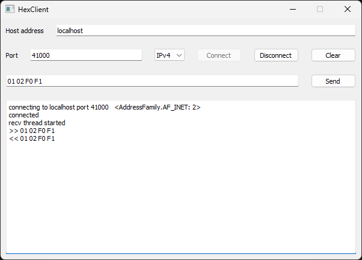
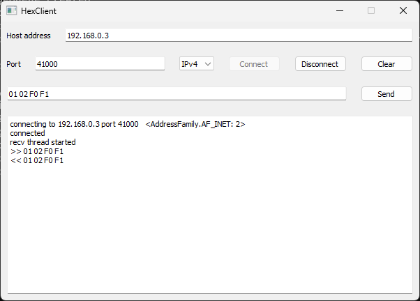

# TCP client

- TCP
- TCP Client
- IPv4
- IPv6
- Python
- PyQt5
- GUI

---

Can be tested with [TCP Echo Server](../TcpServer/)

## Testing on the same computer

### IPv4

Let's say we have cloned the whole repository to `C:\tmp\samples` directory on a Windows computer. Open TCP Echo Server solution in Visual Studio 2022 and build it in Any CPU Release configuration.

Run TCP echo server:

```
C:\tmp\samples\Networking\TCP\TcpServer\EchoServer\bin\Release\net8.0>EchoServer
EchoServer port 41000, Address family InterNetwork
Server: Socket is created
Server: Socket is bound
Echo server is running. Press any other key to stop
Server: Socket is listening
```

By default it runs with port 41000, IPv4. If you have a Firewall, you may be asked to enable a Firewall exception for the server program. This is not necessary for this specific local test. However, if you want to access the server from another computer, accept this suggestion.

Now start the client:

```
C:\tmp\samples\Networking\TCP\TcpHexClient>python hex_client.py
08:34:37.035: <module>: HexClient started
08:34:37.051: _fromConfig: KeyError 'settings'
08:34:37.051: _load: host "localhost" port 41000 ipv 0 data
08:34:37.051: __init__: MessageQueue created
08:34:37.051: run: thread function started
```
Select the following client parameters: localhost, 41000, IPv4. Click Connect. Once connected, type any hexadecimal string, for example, `01 02 F0 F1` and click Send:



Close TCP client. To stop TCP server properly, click any key in the Console window.

### IPv6

Run TCP server with parameters `41000 6`:
```
C:\tmp\samples\Networking\TCP\TcpServer\EchoServer\bin\Release\net8.0>EchoServer 41000 6
EchoServer port 41000, Address family InterNetworkV6
Server: Socket is created
Server: Socket is bound
Echo server is running. Press any other key to stop
Server: Socket is listening
```

Run TCP client as in the previous test, select localhost, 41000, IPv6, Connect. It should work by the same way, as for IPv4.


## Testing on two computers

Let's say we have two Windows computers, connected with an Ethernet cable.

Computer A: IPv4 192.168.0.1, mask 255.255.0.0. IPv6 fc00::1, subnet prefix length 64.

Computer B: IPv4 192.168.0.3, mask 255.255.0.0. IPv6 fc00::3, subnet prefix length 64.

On both computers we clone this repository to `C:\tmp\samples` directory. We will use computer A to run Python client, and B to run C# TCP server. Open TCP Echo Server solution in Visual Studio 2022 and build it in Any CPU Release configuration.

### IPv4

Start TCP server on computer B:

```
C:\tmp\samples\Networking\TCP\TcpServer\EchoServer\bin\Release\net8.0>EchoServer.exe
EchoServer port 41000, Address family InterNetwork
Server: Socket is created
Server: Socket is bound
Echo server is running. Press any other key to stop
Server: Socket is listening
```

Start TCP client on computer A:

```
C:\tmp\samples\Networking\TCP\TcpHexClient>python hex_client.py
08:29:19.236: <module>: HexClient started
08:29:19.252: _load: host "192.168.0.3" port 41000 ipv 0 data 01 02 F0 F1
08:29:19.252: __init__: MessageQueue created
08:29:19.252: run: thread function started
```
Select the following client parameters: 192.168.0.3, 41000, IPv4. Click Connect. Once connected, type any hexadecimal string, for example, `01 02 F0 F1` and click Send:



### IPv6

Run TCP echo server with default port and IPv6 protocol:

```
C:\tmp\samples\Networking\TCP\TcpServer\EchoServer\bin\Release\net8.0>EchoServer.exe 41000 6
EchoServer port 41000, Address family InterNetworkV6
Server: Socket is created
Server: Socket is bound
Echo server is running. Press any other key to stop
Server: Socket is listening
```

Run TCP client. Select the following client parameters: fc00::3, 41000, IPv6. Click Connect. Once connected, type any hexadecimal string, for example, `01 02 F0 F1` and click Send:


