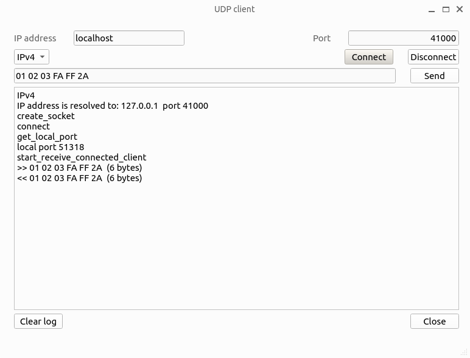
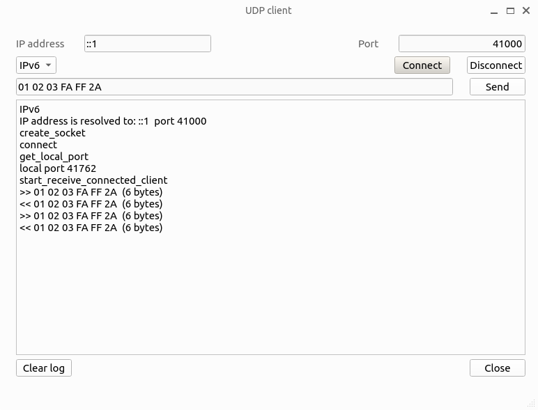

# UDP client and server

- UDP
- UDP client
- UDP server
- IPv4
- IPv6
- Qt
- C++
- Windows
- Linux

## General notes about UDP communications

After TCP, UDP may look somewhat embarassing. UDP socket allows to do absolutely everything.

> There is only one rule: there are no rules.

UDP socket can send a datagram to any other UDP socket, providing that destination IP address and port are known. UDP socket can receive a datagram from any other UDP socket, providing that sender knows the destination IP address and port. This is, basically, UDP "No rules" rule. Here we are talking only about unicast. UDP broadcasting is not covered in this sample.

Trying to design some minimal application scenario, I need to define some additional rules. So, once UDP socket is created, it needs to send a messages to another socket. What is destination IP and port? Let's define our socket as client, and destination socket as server.

### UDP server

UDP server runs on well-known IP address and port. Tun run on specific port, it calls the `bind` function. Then it enters an endless loop, reading incoming messages: `recvfrom`, and serving them. If necessary, server replies to client, using client's IP and port.

Remember "No rules" rule? UDP server can perfectly run on ephemeral port, without `bind`. In UDP, everything is optional.

### UDP client

UDP client runs on ephemeral port, this means, it gets a free port number from OS every time, when socket is created. To talk with some UDP server, client needs to know the server IP address and port.

UDP client calls `connect` function with destination address as parameter. UDP `connect` does not create any connection (UDP protocol is connectionless), but it allows to optimize the subsequent `recv` and `send` functions. Finally, client uses `send` to send a datagram to the server, and `recv` to receive server reply.

What about "No rules"? `connect` is optional, UDP client can work without it. 

## Sample projects: UDP server and client

### Class `udp_socket`

Both programs use the same `udp_socket` classs, which allows to use it as client or server.

Client:
- Calls `create_socket(ip_version ipv, int max_length)`
- Calls `start_receive_connected_client()`
- Sends data to server, using `send(const uint8_t* data, int length)`
- Receives data from server, using `virtual void data_received(const uint8_t* data, int size, const sockaddr* addr, int addr_len)`

Server:
- Calls `create_socket(ip_version ipv, int max_length)`
- Calls `bind(unsigned short port)`
- Calls `start_receive_server()`
- Receives data from clients, using `virtual void data_received(const uint8_t* data, int size, const sockaddr* addr, int addr_len)`
- Sends data to clients, using `send(const uint8_t* data, int size, const sockaddr* addr, int addr_len)`

### Implementation

Internally, `udp_socket` creates `udp_socket_impl` instance, which has platform-specific implementations. In Windows it is implemented using Winsock library, in Linux - using Linux sockets.

### UDP client project

Project is built using Qt Creator. This is GUI application. It allows to send any data, typed as hexadecimal string, to the server.

### UDP server project

Project is built using Qt Creator. This is command-line application, it doesn't use any Qt class and doesn't have Qt runtime dependency. So, Qt Creaqtor is used only as IDE.

`class echo_server : public udp_socket` overrides `data_received` method, sending the same data back to client, so this program works as UDP echo server.

Both projects are working in Windows and Linux OS.

## Testing

There are several options to run client and server programs:

- On the same computer or different computers.
- On Windows or Linux OS.
- IPv4 or IPv6.

So, there are many combinations, I will show only some of them.

### Computers for testing

Linux.

Ubuntu 22.04, x64. Qt Creator 10.0.2. IPv4 address 192.168.0.1, network mask 255.255.255.0. IPv6 address fc00::1, subnet prefix length 64. Github `samples` repository is cloned to `~/tmp/samples`.

Windows.

Windows 11, x64. Qt Creator 14.0.1, MSVC 2019 compiler. IPv4 address 192.168.0.3, network mask 255.255.255.0. IPv6 address fc00::3, subnet prefix length 64. Github `samples` repository is cloned to `C:\tmp\samples`.

Computers are connected using Ethernet cable. 

```
C:\Users\Alex>ping 192.168.0.1

Pinging 192.168.0.1 with 32 bytes of data:
Reply from 192.168.0.1: bytes=32 time<1ms TTL=64
Reply from 192.168.0.1: bytes=32 time<1ms TTL=64
Reply from 192.168.0.1: bytes=32 time<1ms TTL=64
Reply from 192.168.0.1: bytes=32 time<1ms TTL=64

Ping statistics for 192.168.0.1:
    Packets: Sent = 4, Received = 4, Lost = 0 (0% loss),
Approximate round trip times in milli-seconds:
    Minimum = 0ms, Maximum = 0ms, Average = 0ms
	
C:\Users\Alex>ping fc00::1

Pinging fc00::1 with 32 bytes of data:
Reply from fc00::1: time<1ms
Reply from fc00::1: time=1ms
Reply from fc00::1: time<1ms
Reply from fc00::1: time=1ms

Ping statistics for fc00::1:
    Packets: Sent = 4, Received = 4, Lost = 0 (0% loss),
Approximate round trip times in milli-seconds:
    Minimum = 0ms, Maximum = 1ms, Average = 0ms
```

On both computers, open projects `udp_server` and `udp_client`, build them in Release configuration.

### Same computer, Linux, IPv4

Start the server:

```
alex@u23:~/tmp/samples/Networking/UDP/sv_client/udp_server/release$ ./udp_server 
create_socket 
bind to port  41000 
start_receive_server 
Server is running. Port  41000  IPv4 
Enter any string to exit 
```

Start the client:

```
alex@u23:~/tmp/samples/Networking/UDP/sv_client/udp_client/release$ ./udp_client
```

Address localhost, port 41000. Connect. Type any hexadecimal data, press Send.




### Same computer, Linux, IPv6

Start the server:

```
alex@u23:~/tmp/samples/Networking/UDP/sv_client/udp_server/release$ ./udp_server 41000 6
create_socket 
bind to port  41000 
start_receive_server 
Server is running. Port  41000  IPv6 
Enter any string to exit 
```

Client. Address ::1 (localhost is not working for now, I hope to solve the problem later). Port 41000.



### Linux server, Windows client, IPv4

Linux:

```
alex@u23:~/tmp/samples/Networking/UDP/sv_client/udp_server/release$ ./udp_server 
create_socket 
bind to port  41000 
start_receive_server 
Server is running. Port  41000  IPv4 
Enter any string to exit 
```

Windows:


### Linux server, Windows client, IPv6

Linux:

```
alex@u23:~/tmp/samples/Networking/UDP/sv_client/udp_server/release$ ./udp_server 41000 6
create_socket 
bind to port  41000 
start_receive_server 
Server is running. Port  41000  IPv6 
Enter any string to exit 
```

Windows:


