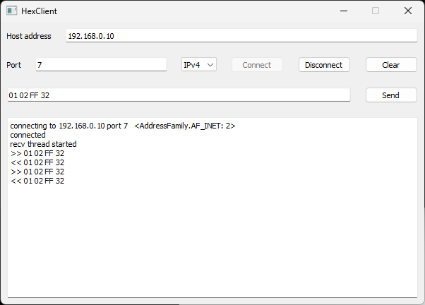

# UDP broadcast

- UDP
- Broadcast
- IPv4
- Network discovery
- C
- C#
- STM32
- STM32CubeIDE
- Embedded
- STM32469I-EVAL
- Visual Studio 2022

---

The code in this repository is based on LwIP_UDPTCP_Echo_Server_Netconn_RTOS code example for STM32469I-EVAL evaluation board:

**Copyright (c) 2017 STMicroelectronics**

**Copyright (c) 2001-2003 Swedish Institute of Computer Science**

---

Consider the situation, when we are developing some hardware device, having an Ethernet connector or WiFi. Device can be controlled from the host program, it accepts TCP connections and serves them. Device TCP server runs on known static IP address and port.

Upon startup, device reads its IP address from flash memory. Device contains also public interface to change its IP address, for example, HTTP Settings page.

Some user changes the default IP address to something else, probably, with another subnet, and then forgets this new address. Now this user cannot connect to device. 

One possible solution maybe Factory Reset button, which returns the device to default state, including default IP address. But additional button increases our device cost. Any other idea? UDP broadcast can help in this case. Broadcasted packets can move between a network nodes, even when these nodes don't belong to the same subnet.

We can send Factory Reset request to the device. Another approach: host sends Device Detection packets. Upon receiving such packet, device replies with Device Information packet, which contains current device IP. 

This sample shows, how to implement device detection with STM32 board and host FindDevice program.

## Communication protocol

We define our device-specific communication protocol by the following way:

```
Detection UDP port:    8
Detection request:     A0 50 xx xx xx xx xx xx xx xx
Detection reply:       A0 50 i0 i1 i2 i3 m0 m1 m2 m3

xx - any byte
i0 i1 i2 i3 - device IP address.
m0 m1 m2 m3 - device subnet mask.
```

## Different ways to create STM32 project

[STM32 TCP communications](../../../STM32/tcp_comm/) example shows, how to create a new STM32 project, using CubeMX code generator and Device Configiration file `.ioc`.

Another way is to use some STM32 code example as start point for our new project. What is the difference? STM example doesn't contain Device Configuration file. Any change in device configuration should be done manually in the code. This way is probably for more advanced STM users. It is good also for developing fast prototypes, like one we want to make now.

Finally, it is possible to start a new project from scratch.

## Creating a new STM32 project from STM code example


This document describes building and running the program for STM32469I-EVAL evaluation board. Any other STM32 board with an Ethernet connector can be used. Just follow the same steps, as described in this article, making corrections for specific board type, when necessary.

First I want to find an example to start with. On my computer, STM examples can be found in `C:\Users\alex\STM32Cube\Repository\STM32Cube_FW_F4_V1.28.0\Projects\STM32469I_EVAL` directory. `Applications\LwIP\LwIP_UDPTCP_Echo_Server_Netconn_RTOS` looks like a good start point. It implements TCP and UDP echo servers, running on the port 7. I want to replace UDP echo functionality with UDP device detection.

STM sample can be imported to STM32CubeIDE using *File - Import - General - Existing projects into workspace* function. But if we move the project to another place, it stops working.

The better way is: 
- Start STM32CubeIDE.
- *File - Import - General - Import STM32CubeExample*. Next.
- Click Example Selector. Find required example in the huge list. In my case, this is LwIP_UDPTCP_Echo_Server_Netconn_RTOS, STM32469I-EVAL. Select the example and continue.
- Select destination directory to save the project.

## Coding

- Comment `#define USE_LCD` in the file `inc/main.h`. Probably, in your project such line doesn't exist, this is OK. We don't need this annoying LCD stuff.
- In the file `inc/lwipopt.h` change the value of `LWIP_DHCP` from 1 to 0.

Board IP address is `192.168.0.10 / 24`, see `main.h`. TCP port is 7, see 

```
err = netconn_bind(conn, NULL, 7)
``` 

in `tcpecho.c`.

Build and run the project. Connect the board and PC with an Ethernet cable. Set PC IP address `192.168.0.1`, subnet mask `255.255.255.0`.

```
C:\Windows\System32>ping 192.168.0.10

Pinging 192.168.0.10 with 32 bytes of data:
Reply from 192.168.0.10: bytes=32 time<1ms TTL=255
Reply from 192.168.0.10: bytes=32 time<1ms TTL=255
Reply from 192.168.0.10: bytes=32 time<1ms TTL=255
Reply from 192.168.0.10: bytes=32 time<1ms TTL=255

Ping statistics for 192.168.0.10:
    Packets: Sent = 4, Received = 4, Lost = 0 (0% loss),
Approximate round trip times in milli-seconds:
    Minimum = 0ms, Maximum = 0ms, Average = 0ms
```
Now let's test TCP Echo functionality. Run [TCP client](../../TCP/TcpHexClient/) program, select IP address `192.168.0.10`, port 7, IPv4. Click Connect. Type any hexadecimal string, click Send. 




In STM32 project, open file `Application/User/udpecho.c`. Change it, as shown here: [udpecho.c](stm_udp/udpecho.c). Existing function `udpecho_thread` is commented and replaced with `udpbroadcast_thread`.

Build and run the project.

---

Note. Our STM32 project has hard-coded IP address. In real life, IP address is read from the device flash memory.

---

## Testing Device Detection function

Open [FindDevice](FindDevice/) project in Visual Studio 2022. This C# program enumerates all available Ethernet adapters, and broadcasts Device Detection requests from every adapter. Device replies are collected, and finally, full list of detected devices is printed. Build and run the program:

```
Finder started, Port 8
...
Device: 192.168.0.10 255.255.255.0  Host: 192.168.0.1  [Ethernet 1]
```

Change host IP address to another subnet, for example, ``192.168.1.1`. Or even, select DHCP instead of static IP. Run the program again:

```
Finder started, Port 8
...
Device: 192.168.0.10 255.255.255.0  Host: 10.90.185.78  [Ethernet 1]
```
