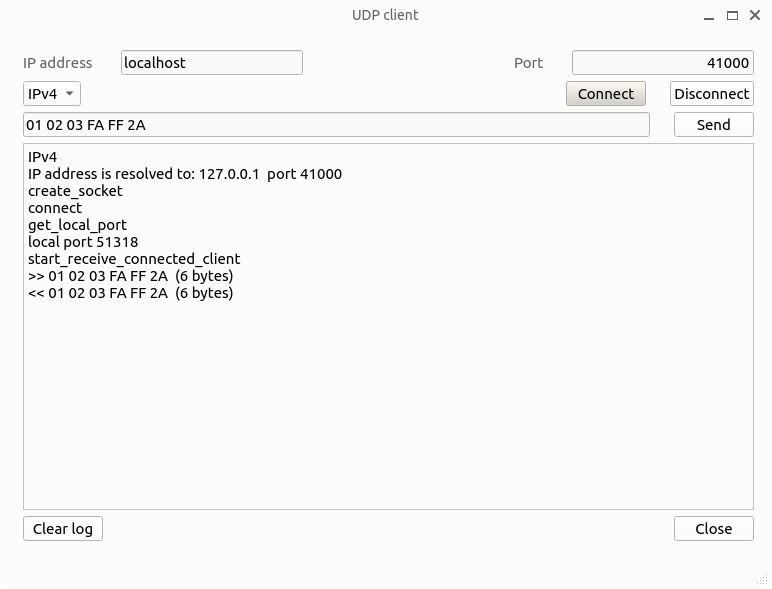
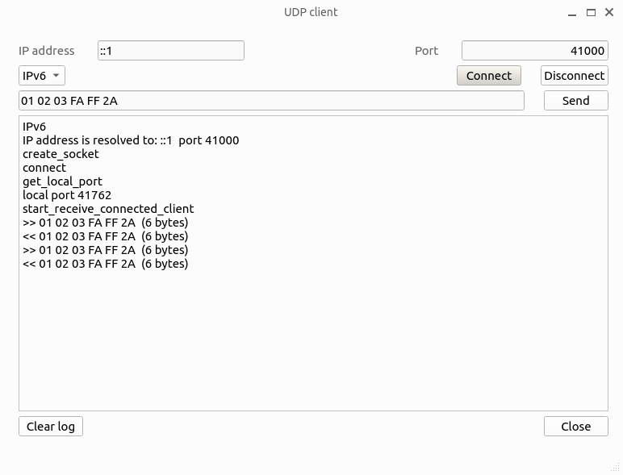
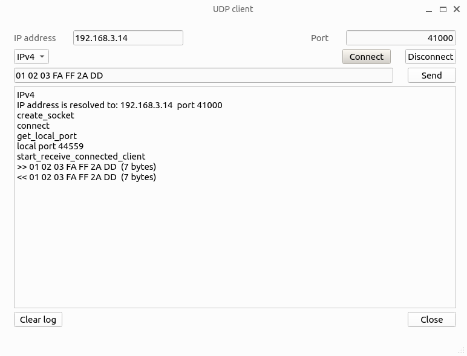
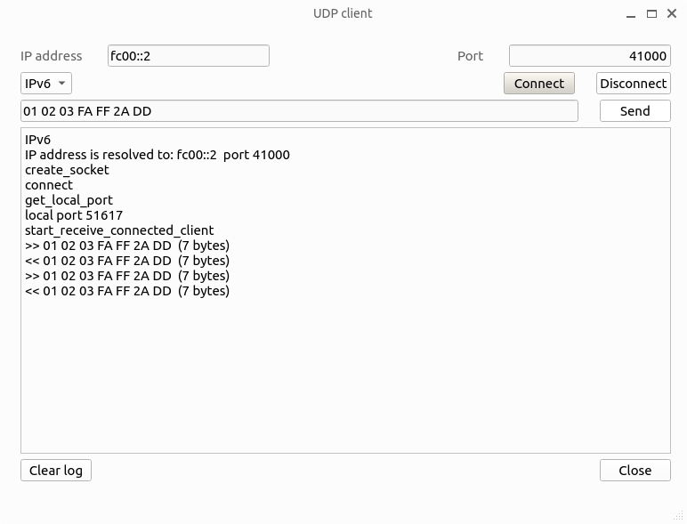
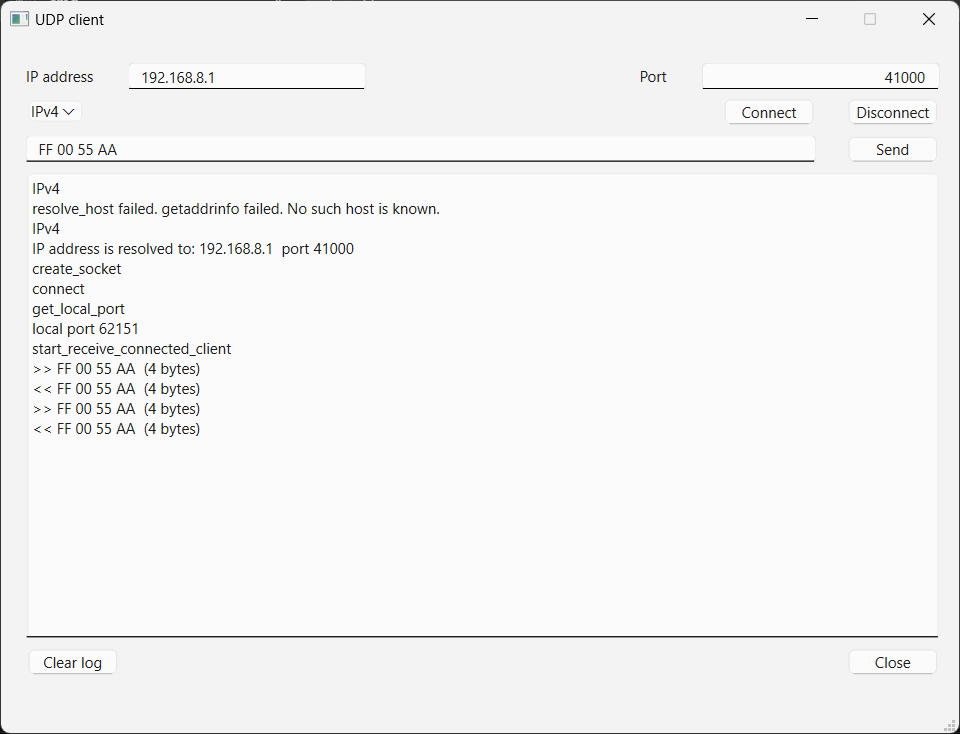

# UDP echo server

- UDP
- UDP server
- IPv4
- IPv6
- C++
- Linux
- Embedded Linux
- Raspberry Pi
- BeagleBone
- WiFi

## udp_echo_server program

This program works like [C++ UDP echo server](../sv_client/udp_server), with some differences:

- It is written in C.
- Program is not cross-platform, runs only on Linux (including Embedded).
- Contains only minimal necessary code.
- Critical errors are reported and `exit` is called (no clean exit).
- Finished with an endless loop waiting for incoming messages, to stop it in the terminal window `Ctrl+C` is used.
- This directory doesn't contain any IDE project or makefile, we will build the program from command line.
- Otherwise, it works exactly like C++ UDP echo server, see [documentation](../sv_client/readme.md).

## Testing on Desktop Linux computer

Since the program doesn't contain any embedded or board-specific code, we can test it first on PC computer. In my case, this is Ubuntu 22.04 x64.
We assume that `samples` repository is cloned to `~/tmp` directory.

Let's build and run the program:

```
alex@u23:~/tmp/samples/Networking/UDP/udp_echo_server$ gcc udp_echo_server.c -o udp_echo_server
alex@u23:~/tmp/samples/Networking/UDP/udp_echo_server$ ./udp_echo_server
UDP echo server started
port 41000 IPv4
socket is created
bound to port 41000
```

Now open [UDP client](../sv_client/udp_client) project in Qt Creator and build it in Release configuration. Start `udp_client`:

```
alex@u23:~/tmp/samples/Networking/UDP/sv_client/udp_client/Release$ ./udp_client
```



Press `Ctrt+C` to stop `udp_echo_server` and run it again in IPv6:

```
alex@u23:~/tmp/samples/Networking/UDP/udp_echo_server$ ./udp_echo_server 41000 6
UDP echo server started
port 41000 IPv6
socket is created
bound to port 41000
```

Run `udp_client`:




## Prepare Raspberry Pi board for testing

This description is board-specific: I am using Raspberry Pi 4 Model B. Generally, any Embedded Linux board with Ethernet connector is OK for this test.

We need SD card with operating system, as described in the [Raspberry Pi](https://www.raspberrypi.com/documentation/computers/getting-started.html) article. By default, user name is `pi`, password `raspberry`.

Before running the board, we need to set static IP address. Connect SD card to Linux PC. Open file `/media/user/rootfs/etc/dhcpcd.conf` in text editor. Doesn't work? Try to do this with `sudo`.

Add the following lines to the end of `dhcpcd.conf`:

```
interface eth0
static ip_address=192.168.3.14/24
static ip6_address=fc00::2/64
static routers=192.168.3.1
static domain_name_servers=192.168.3.1 8.8.8.8 fd51:42f8:caae:d92e::1
```
Save file, remove SD card from PC and attach it to the board.

Set PC static IPv4 address `192.168.3.1/24` and IPv6 address `fc00::1/64". Connect PC and board with an Ethernet cable, power up the board.

```
alex@u23:~$ ping 192.168.3.14
PING 192.168.3.14 (192.168.3.14) 56(84) bytes of data.
64 bytes from 192.168.3.14: icmp_seq=1 ttl=64 time=0.348 ms
64 bytes from 192.168.3.14: icmp_seq=2 ttl=64 time=0.212 ms
alex@u23:~$ ping fc00::2
PING fc00::2(fc00::2) 56 data bytes
64 bytes from fc00::2: icmp_seq=1 ttl=64 time=0.496 ms
64 bytes from fc00::2: icmp_seq=2 ttl=64 time=0.217 ms
```

## Testing on Raspberry Pi

We need to copy file `udp_echo_server.c` to the board. Then we login using SSH, complile and run the program:

```
alex@u23:~/tmp/samples/Networking/UDP/udp_echo_server$ scp udp_echo_server.c pi@192.168.3.14:/home/pi
pi@192.168.3.14's password: 
udp_echo_server.c                                                                             100% 4132     3.6MB/s   00:00    
alex@u23:~/tmp/samples/Networking/UDP/udp_echo_server$ ssh pi@192.168.3.14
pi@192.168.3.14's password: 
Linux raspberrypi 5.10.63-v7l+ #1459 SMP Wed Oct 6 16:41:57 BST 2021 armv7l

The programs included with the Debian GNU/Linux system are free software;
the exact distribution terms for each program are described in the
individual files in /usr/share/doc/*/copyright.

Debian GNU/Linux comes with ABSOLUTELY NO WARRANTY, to the extent
permitted by applicable law.
Last login: Sat Dec  4 19:17:12 2021
pi@raspberrypi:~ $ ls
Bookshelf  Documents  label.txt  Music     Public     test               Videos
Desktop    Downloads  Pictures  Templates  udp_echo_server.c
pi@raspberrypi:~ $ gcc udp_echo_server.c -o udp_echo_server
pi@raspberrypi:~ $ file udp_echo_server
udp_echo_server: ELF 32-bit LSB executable, ARM, EABI5 version 1 (SYSV), dynamically linked, interpreter /lib/ld-linux-armhf.so.3, BuildID[sha1]=b1e788df605d1b5318621e9783f88aa1be35785b, for GNU/Linux 3.2.0, not stripped
pi@raspberrypi:~ $ ./udp_echo_server
UDP echo server started
port 41000 IPv4
socket is created
bound to port 41000

```

Run `udp_client`:



Stop `udp_echo_server` by pressing `Ctrl+C`and run it again as IPv6:

```
pi@raspberrypi:~ $ ./udp_echo_server
UDP echo server started
port 41000 IPv4
socket is created
bound to port 41000
^C
pi@raspberrypi:~ $ ./udp_echo_server 41000 6
UDP echo server started
port 41000 IPv6
socket is created
bound to port 41000
```

Run `udp_client`:




## Cross-compilation

Building a program directly on embedded board is not a good idea. Better build our program on PC and then deploy it to the board.

Installing correct cross-compiler may be quite complicated, I am not going to explain this topic here. Finally, having `arm-linux-gnueabihf-gcc` cross-compiler on the PC, we can build the program:

```
alex@u23:/home/alex/tmp/samples/Networking/UDP/udp_echo_server$ arm-linux-gnueabihf-gcc udp_echo_server.c -o udp_echo_server
alex@u23:/home/alex/tmp/samples/Networking/UDP/udp_echo_server$ file udp_echo_server
udp_echo_server: ELF 32-bit LSB pie executable, ARM, EABI5 version 1 (SYSV)
```

Then we can copy `udp_echo_server` executable to the board with `scp` command, and execute it there there.

## Communication over WiFi with BeagleBone Black Wireless

Let's place our program to BBW, and talk with our server, using WiFi connection.

When BBW is connected to the Linux PC using USB, Ethernet over USB connection is available. It is used for development, PC address is 192.168.1.1, board address is 192.168.1.2. 

```
alex@u23:~$ ping 192.168.6.2
PING 192.168.6.2 (192.168.6.2) 56(84) bytes of data.
64 bytes from 192.168.6.2: icmp_seq=1 ttl=64 time=0.487 ms
64 bytes from 192.168.6.2: icmp_seq=2 ttl=64 time=0.385 ms
64 bytes from 192.168.6.2: icmp_seq=3 ttl=64 time=0.380 ms
```

By default, user name is debian, password temppwd. So, we can copy our program to the board:

```
alex@u23:~/tmp/samples/Networking/UDP/udp_echo_server$ scp udp_echo_server.c debian@192.168.6.2:/home/debian
Debian GNU/Linux 10

BeagleBoard.org Debian Buster IoT Image 2020-04-06

Support: http://elinux.org/Beagleboard:BeagleBoneBlack_Debian

default username:password is [debian:temppwd]

debian@192.168.6.2's password: temppwd
udp_echo_server.c       
```

Login to BBW, compile and run our program:

```
alex@u23:~$ ssh debian@192.168.6.2
The authenticity of host '192.168.6.2 (192.168.6.2)' can't be established.
ED25519 key fingerprint is SHA256:7I1VDSQJpGA20QBbo5WKnUNhH0Ki3n7l8QmNj1HAnL0.
This key is not known by any other names
Are you sure you want to continue connecting (yes/no/[fingerprint])? yes
Warning: Permanently added '192.168.6.2' (ED25519) to the list of known hosts.
Debian GNU/Linux 10

BeagleBoard.org Debian Buster IoT Image 2020-04-06

Support: http://elinux.org/Beagleboard:BeagleBoneBlack_Debian

default username:password is [debian:temppwd]

debian@192.168.6.2's password: temppwd

The programs included with the Debian GNU/Linux system are free software;
the exact distribution terms for each program are described in the
individual files in /usr/share/doc/*/copyright.

Debian GNU/Linux comes with ABSOLUTELY NO WARRANTY, to the extent
permitted by applicable law.
Last login: Wed May 11 04:29:46 2022 from 192.168.6.1

debian@beaglebone:~$ gcc udp_echo_server.c -o udp_echo_server
debian@beaglebone:~$ ./udp_echo_server 
UDP echo server started
port 41000 IPv4
socket is created
bound to port 41000
```

At this point, we can run our `udp_client` and use `192.168.6.2` IP address. But this is not interesting, since this connection is used only for development.

Public BBW interface is WiFi. By default, it's name is `BeagleBone-363F`, password BeagleBone, IP address 192.168.8.1.

It is possiblt to connect to BBW WiFi from any computer. My Windows 11 laptop looks good for this task. When placed close to BBW, I can see `BeagleBone-363F` in the list of available WiFi connections. Select it, Enter BeagleBone password. Once this is done, check connection:

```
C:\Windows\System32>ping 192.168.8.1

Pinging 192.168.8.1 with 32 bytes of data:
Reply from 192.168.8.1: bytes=32 time=37ms TTL=64
Reply from 192.168.8.1: bytes=32 time=3ms TTL=64
Reply from 192.168.8.1: bytes=32 time=3ms TTL=64
Reply from 192.168.8.1: bytes=32 time=3ms TTL=64

Ping statistics for 192.168.8.1:
    Packets: Sent = 4, Received = 4, Lost = 0 (0% loss),
Approximate round trip times in milli-seconds:
    Minimum = 3ms, Maximum = 37ms, Average = 11ms
```

On the laptop, assuming that `samples` repository is cloned to `C:\tmp\samples`, open project `C:\tmp\samples\Networking\UDP\sv_client\udp_client\udp_client\udp_client.pro` in Qt Creator. Build and run it:




