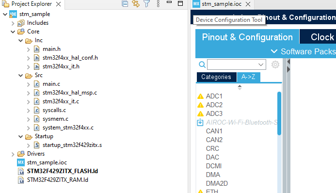
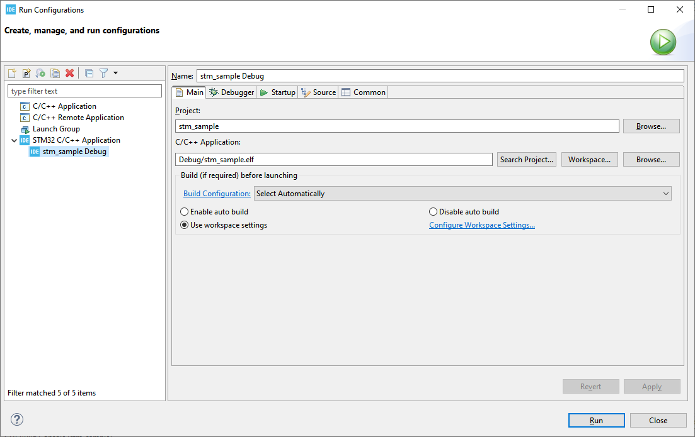
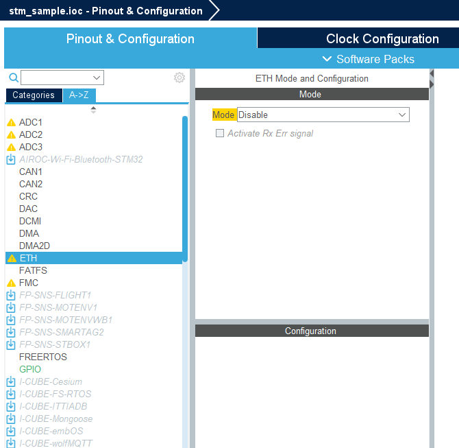
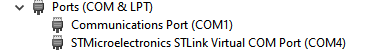

# STM32 TCP communications

- STM32
- STM32CubeIDE
- NUCLEO-F429ZI
- TCP
- TCP server
- IPv4
- C
- Embedded

This document describes building and running the program for [NUCLEO-F429ZI](https://www.st.com/en/evaluation-tools/nucleo-f429zi.html) evaluation board. Any other STM32 F4 board with an Ethernet connector can be used. Just follow the same steps, as described in this article, making corrections for specific board type, when necessary.

The code in this repository is based on `LwIP_HTTP_Server_Netconn_RTOS` code example for NUCLEO-F429ZI evaluation board: 

**Copyright (c) 2017 STMicroelectronics** 

and other STM32 examples.

Working environment:
- Windows 11.
- STM32CubeIDE version 1.16.0.
- Firmware package 1.28.0.

## Software installation

If not installed yet, download and install [STM32CubeIDE](https://www.st.com/en/development-tools/stm32cubeide.html). Downloading is free, requires e-mail registration. Keep e-mail and password for future use.

When STM32CubeIDE is executed first time, login to your STM32 account. Otherwise, you will be asked for login details later.

## STM32 projects in the samples repository

There are 3 projects in the `samples/STM32` directory: the same project on different development stages.
- [diff/1.new_project](diff/1.new_project/) - just created by STM32CubeIDE Wizard.
- [diff/2.cubemx/](diff/2.cubemx/) - device configuration finished.
- [stm_sample](stm_sample/) - code is added, final state.

You only need to open `stm_sample` project in STM32CubeIDE. `diff` is used to follow the changes, done on different development steps. For example, difference between [stm_sample](stm_sample/) and [2.cubemx/](diff/diff/2.cubemx/) gives the code, added to project manually.

Every STM32 project contains only minimal set of files. Missing files can be created by STM32CubeMX tool:
- Open [stm_sample](stm_sample/) directory in STM32CubeIDE: File - Import - General - Existing project into workspace.
- Open `.ioc` file in the Project Explorer and execute Project - Generate code.

You can use [stm_sample](stm_sample/) directly, only if you have NUCLEO-F429ZI. 

---

Tip for new Eclipse users:
To open an existing STM32 project in STM32CubeIDE:
- File - Import - General - Existing project into workspace.
- Select required project directory.
---

For any other board, create a new project and follow the instructions below.

## Creating a new STM32 project

- Run STM32CubeIDE.
- File - New - STM32 project.
- Board selector - NUCLEO-F429ZI - Next. On this tsage, select your actual board.
- Select project name and location (better to use non-default location, i.e. not under the workspace directory). Language C. Binary type - executable. Project type - STM32Cube. Next.
- Accept default options, including the latest firmware package. In my case this is STM32Cube FW_F4 V.1.28.0. Finish.
- *Initialize all peripherals with their default mode?* No.

Project Explorer should look like this:




If you don't see full source files tree - open Device Configuration tool (double-click `stm_sample.ioc` in the Project Explorer), and execute Project - Generate code.

At this stage it is possible to build the project and run it on the board. 

---
Tip for new Eclipse users.

If you see this message:
*The selection cannot be launced, and there are no recent launches*, 
Open Run configurations dialog and create new STM32 configuration:


---

Execute this "do-nothing" program:

```
STMicroelectronics ST-LINK GDB server. Version 7.8.0
Copyright (c) 2024, STMicroelectronics. All rights reserved.

Starting server with the following options:
        Persistent Mode            : Disabled
        Logging Level              : 1
        Listen Port Number         : 61234
        Status Refresh Delay       : 15s
        Verbose Mode               : Disabled
        SWD Debug                  : Enabled
        InitWhile                  : Enabled

Waiting for debugger connection...
Debugger connected
Waiting for debugger connection...
Debugger connected
Waiting for debugger connection...
      -------------------------------------------------------------------
                       STM32CubeProgrammer v2.17.0                  
      -------------------------------------------------------------------

Log output file:   C:\Users\Alex\AppData\Local\Temp\STM32CubeProgrammer_a13456.log
ST-LINK SN  : 066DFF484957847167063817
ST-LINK FW  : V2J43M28
Board       : NUCLEO-F429ZI
Voltage     : 3.25V
SWD freq    : 4000 KHz
Connect mode: Under Reset
Reset mode  : Hardware reset
Device ID   : 0x419
Revision ID : Rev 3
Device name : STM32F42xxx/F43xxx
Flash size  : 2 MBytes
Device type : MCU
Device CPU  : Cortex-M4
BL Version  : 0x91

Memory Programming ...
Opening and parsing file: ST-LINK_GDB_server_a13456.srec
  File          : ST-LINK_GDB_server_a13456.srec
  Size          : 6.20 KB 
  Address       : 0x08000000 

Erasing memory corresponding to segment 0:
Erasing internal memory sector 0
Download in Progress:

File download complete
Time elapsed during download operation: 00:00:00.368

Verifying ...

Download verified successfully 

Shutting down...
Exit.
```

In this initial state project is copied to [diff/1.new_project](diff/1.new_project/) directory. `diff` directory can be used to compare the state of the project on different development stages. So, `diff/1.new_project` is "Just created, do-nothing" stage. 


## Device Configuration



The left configuration pave contains the list of devices and software packages. Select required element and then configure it in the right pane.

### UART for tracing

USART3, Mode Asynchronous, Flow control disabled, Baud rate 115200, Wordl length 8, Parity None, Stop bits 1.

USART3 in NUCLEO-F429ZI is connected to Serial-over-USB port. Connect the board to PC with USB cable. Required STM32 drivers should be already installed, this is done by STM32CubeIDE installation. installed Open PC Device manager:



We can view COM4 (name may be different), using any serial port 


