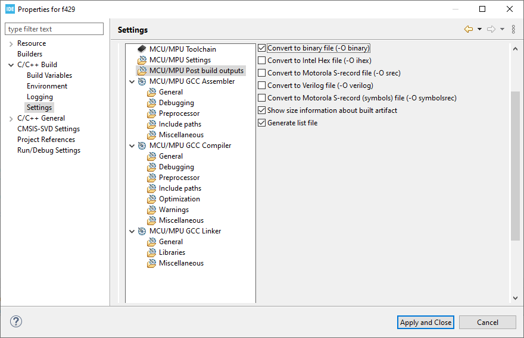
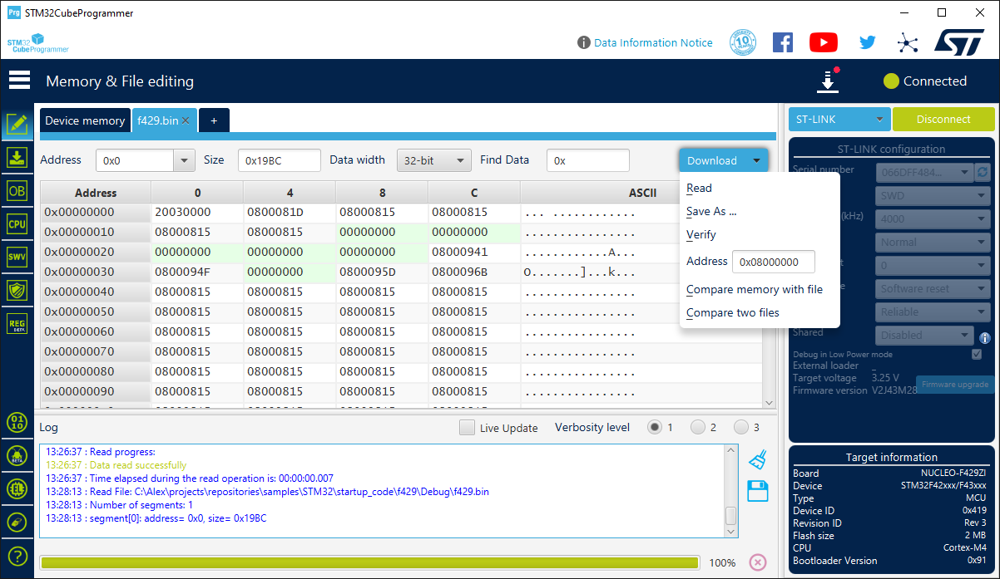

# STM32 startup code

- STM32
- STM32CubeIDE
- NUCLEO-F429ZI
- C
- Assembly
- ARM
- Cortex
- Embedded


## Links

- [Klein Embedded: STM32 without CubeIDE](https://kleinembedded.com/stm32-without-cubeide-part-1-the-bare-necessities/)
- [ARM® Assembly rererence](https://developer.arm.com/documentation/dui0802/latest/)

Working environment:
- Windows 11.
- STM32CubeIDE version 1.16.0.
- Firmware package 1.28.0.

After reading an excellent  [STM32 without CubeIDE](https://kleinembedded.com/stm32-without-cubeide-part-1-the-bare-necessities/) series of articles, I decided to make my own exercise, the result of this exercise is shown in this article. In the project, created by STM32CubeIDE, there is startup file, written in Assembly language. I want to rewrite this file in C language, and by the way to learn some interesting things about STM32 startup process.

I am using [NUCLEO-F429ZI](https://www.st.com/en/evaluation-tools/nucleo-f429zi.html) evaluation board. It is possible to make the same exercise with any STM32 board. Several files, generated by STM32CubeMX, have board-specific names, I will call them using general names:
- STM32F429ZITX_FLASH.ld will be called **Linker script**.
- startup_stm32f429zitx.s will be called **Assembly startup file**.

## Creating a new STM32 project

- Run STM32CubeIDE.
- File - New - STM32 project.
- Board selector - NUCLEO-F429ZI - Next. On this tsage, select your actual board.
- Select project name and location (better to use non-default location, i.e. not under the workspace directory). Language C. Binary type - executable. Project type - STM32Cube. Next.
- Accept default options, including the latest firmware package. In my case this is STM32Cube FW_F4 V.1.28.0. Finish.
- *Initialize all peripherals with their default mode?* No.

## Modifying the source code

Open file `Core/Scr/main.c`, add this code to the endless loop in the `main` function, `USER CODE BEGIN 3` section:

```
    /* USER CODE BEGIN 3 */
    HAL_GPIO_TogglePin(LD1_GPIO_Port, LD1_Pin);
    HAL_Delay(500);	  
```

Build and run the project: LED1 is blinking. Later in the article, I will call this project state as **Default state**. At any time, when necessary, it is possible to return to this ***Default state** by activating the Assembly startup file.

## Replacing Assembly startup file with C file

Right-click the Assembly startup file in `Core/Src/Startup` directory, select C/C++ Build - Settings, check Exclude resource from build:


Try to build the project, result is: `cannot find entry symbol Reset_Handler`. `Reset_Handler` is defined in the linker script, as the program entry point: 

```
ENTRY(Reset_Handler)
```

It was defined in Assembly file, now we need to provide another implementation. Add new file `startup.c` to `Core/Src` and fill it with the following code:

```
#include <stdint.h>

void Reset_Handler();
void Default_Handler();
int main(void);

uint32_t g_data1 = 0xA1020304;	// Initialized data
uint32_t g_data2;               // Uninitialized data


void Reset_Handler()
{
    for(;;) {}
}
```
Build and run the program. With debugger we can see, that it starts to execute an endless loop. 

## Setting the stack pointer

Set breakpoint in the line `for(;;) {}` and start debugger. What is the value of `sp` register? In my case, it shows `0x4c05b50c`, this looks like a junk.

Return to default state by including Assembly startup file to the build, and excluding `startup.c` file. Set breakpont in the Assembly startup file, on the first line of `Reset_Handler` function. Execute this line and check `sp` register: `0x20030000`. 

Back to `starup.c`: include it to build and exclude the Assembly file from build. How can we fix the stack pointer?

Cortex executable must start from a vector table, which contains initial stack pointer it position 0, and interrupt handlers, starting from position 1. 

From the linker script:

```
RAM    (xrw)    : ORIGIN = 0x20000000,   LENGTH = 192K
FLASH    (rx)    : ORIGIN = 0x8000000,   LENGTH = 2048K
```

We can define:
```
#define SRAM_START (0x20000000U)
#define SRAM_SIZE (192U * 1024U)                // 0x30000
#define SRAM_END (SRAM_START + SRAM_SIZE)
#define STACK_POINTER_INIT_ADDRESS (SRAM_END)
```

`STACK_POINTER_INIT_ADDRESS` gives `0x20030000`.

We need also `Default_Handler` function, which is called for any unimplemented interrupt:

```
void Default_Handler()
{
    for(;;){}
}
```

Define a minimal set of interrupt handlers, copy their names from Assembly startup file:

```
// Cortex-M system exceptions
void Nmi_Handler(void) __attribute__((weak, alias("Default_Handler")));
void Hard_Fault_Handler(void) __attribute__((weak, alias("Default_Handler")));
void Bus_Fault_Handler(void) __attribute__((weak, alias("Default_Handler")));
void Usage_Fault_Handler(void) __attribute__((weak, alias("Default_Handler")));
```

Some of them may be implemented somewhere else in the project. If not, the handler is mapped to `default_handler`. Finally, define the vector table:

```
uint32_t g_pfnVectors[] __attribute__((section(".isr_vector"))) =
{
  STACK_POINTER_INIT_ADDRESS,
  
  // Cortex-M system exceptions
  (uint32_t)&Reset_Handler,
  (uint32_t)&Nmi_Handler,
  (uint32_t)&Hard_Fault_Handler,
  (uint32_t)&Bus_Fault_Handler,
  (uint32_t)&Usage_Fault_Handler
};
```

Start debugging with breakpoint at endless loop in `Reset_Handler`. The value of `sp` register is:
```
0x2002fffc = 0x20030000 - 4
```

Seems to be OK. Now that stack pointer is fixed, let's see the next problem. I want to see the values of `g_data1` and `g_data2` variables. Sometimes debugger is not happy to show a global varables, this helper code allows to see this information in the Registers debugger window:

```
    asm ("ldr r0, = g_data1");  // r0 = &g_data1    0x20000000
    asm ("ldr r1, [r0]");       // r1 = *r0         0xbe00                 junk, expected 0xA1020304
    asm ("ldr r2, = g_data2");  // r2 = &data2      0x20000020
    asm ("ldr r3, [r2]");       // r3 = *r2         0x60015155             junk, expected 0
```

## Global variables

To get properly initialized global variables, we need to understand linker script variables. These variables can be accessed in C program by defining them as `extern uint8_t`, they are placed in the beginning and in the end of different sections.

```
// SRAM:
extern uint8_t _sdata;		// start address for the .data section   (initialized data section)
extern uint8_t _edata;		// end address for the .data section
extern uint8_t _sbss;		// start address for the .bss section     (uninitialized data section)
extern uint8_t _ebss;		// end address for the .bss section

// Flash:
extern uint8_t _sidata;		// start address for initialized values
```

Initialized global variable `g_data1` belongs to `.data` section, uninitialized variable `g_data2` belongs to `.bss` section. We can see the section addresses in the debugger: `&_sdata` etc. It is also possible to load them to the registers, which can be observed in the Registers debugger window:

```
    asm ("ldr r0, =_sdata");    // 0x20000000    r0 = &_sdata   SRAM
    asm ("ldr r1, =_edata");    // 0x20000004    r1 = &_edata   SRAM
    asm ("ldr r2, =_sbss");     // 0x20000004    r2 = &_sbss    SRAM
    asm ("ldr r3, =_ebss");     // 0x20000024    r3 = &_sbss    SRAM
    asm ("ldr r4, =_sidata");   // 0x80000b8     r4 = &_sidata  flash
```
Upon receiving the Reset interrupt, STM32 board loads an executable from its flash memory to SRAM, and calls `Reset_Handler` function. Flash memory is mapped to the virtial address `0x8000000` in the process, and linker label `_sidata` is placed in the beginning of initialized variables section in the flash memory.

Assembly `Reset_Handler` code copies `.data` section from flash ro SRAM, and zeroes `.bss` section. It works like the following C pseudo-code:

```
memcpy(&_sdata, &_sidata, &_edata - &_sdata);
memset(&sbss, 0, &_ebss - &_sbss);
```
This is Assembly `Reset_Handler` code with my C-style comments:
```
  // Copy (&_edata - &_sdata)/4  uint32_t values  from _sidata to _sdata 
  ldr r0, =_sdata               // 0x20000000                 destination address, start (SRAM)
  ldr r1, =_edata               // 0x2000000c                 destination address, end   (SRAM)
  ldr r2, =_sidata              // 0x8001954                  source address, flash
  movs r3, #0                   // r3 = 0                     offset (source, destination, step 4)
  b LoopCopyDataInit            // go to LoopCopyDataInit

CopyDataInit:
  ldr r4, [r2, r3]              // r4 = &(r2 + r3) 0xf42400   read source to r4
  str r4, [r0, r3]              // *(r0 + r3) = r4            write destination from r4
  adds r3, r3, #4               // r3 += 4                    offset += 4

LoopCopyDataInit:
  adds r4, r0, r3               // r4 = r0 + r3   0x20000000 0x20000004 ...   r4 = current destination address
  cmp r4, r1                    // compare r4, r1
  bcc CopyDataInit              // goto if Carry clear (identical to LO, Unsigned lower)   if r4 < r1 go to CopyDataInit
  
  // zero (&_ebss - &_sbss)/4  uint32_t values, starting from _sbss 
  ldr r2, =_sbss                // r2 = &bss                  destination address, start
  ldr r4, =_ebss                // r4 = &bss                  destination address, end
  movs r3, #0                   // r3 = 0                     used to write 0 to destination
  b LoopFillZerobss

FillZerobss:
  str  r3, [r2]                 // *r2 = r3
  adds r2, r2, #4               // r2 += 4

LoopFillZerobss:
  cmp r2, r4                    // compare r2 and r4
  bcc FillZerobss               // if r2 < r4 go to FillZerobss
```

Let's translate this to C and add to `startup.c`:

```
    // Copy (&edata - &_sdata)/4  uint32_t values  from _sidata (flash) to _sdata (SRAM)

    const uint32_t data_size = ((uint32_t)&_edata - (uint32_t)&_sdata) / 4;

    uint32_t *source_ptr = (uint32_t*) &_sidata; // Flash
    uint32_t *dest_ptr = (uint32_t*) &_sdata;    // SRAM

    for (uint32_t i = 0; i < data_size; i++)
    {
        dest_ptr[i] = source_ptr[i];
    }

    asm ("ldr r0, = g_data1");  // 0x20000000
    asm ("ldr r1, [r0]");       // 0xa1020304             OK
    asm ("ldr r2, = g_data2");  // 0x20000020
    asm ("ldr r3, [r2]");       // 0x60015155             still junk

    // zero (&_ebss - &_sbss)/4  uint32_t values, starting from _sbss

    const uint32_t bss_size = ((uint32_t)&_ebss - (uint32_t)&_sbss) / 4;
    dest_ptr = (uint32_t*) &_sbss;

    for (uint32_t i = 0; i < bss_size; i++)
    {
        dest_ptr[i] = 0;
    }

    asm ("ldr r0, = g_data1");  // 0x20000000
    asm ("ldr r1, [r0]");       // 0xa1020304             OK
    asm ("ldr r2, = g_data2");  // 0x20000020
    asm ("ldr r3, [r2]");       // 0x0                    OK
```
The first loop fixes `g_data1` value, the second loop fixes `g_data2`. 


Now that global variables are initialized, I want to call `main` function instead of endless loop:

```
    main();
    //for(;;) {}
```

Run the program - LED1 is not blinking.

## How to get the main function working

Using debugger, we can see that the program crashes in our `Default_handler` is called. Comparing two `Reset_handler` functions, I see the following Assembly lines:

```
bl  SystemInit         /* in the beginning*/
...
bl __libc_init_array   /* before main function */
```
`SystemInit` can be found in the project. Search for `__libc_init_array` in the project doesn't give any results. There are several discussions regaring `__libc_init_array` in the WEB, with some explanations. I call both functions:

```
void SystemInit(void);
void __libc_init_array();

void Reset_Handler()
{
    SystemInit();

    // ...
    
    __libc_init_array();
    main();
}
```
They are executed successfully, but the program still crashes. Currently it crashes on the first `HAL_Delay` call, but don't try to replace it with a busy loop - it wil crash somewhere else.

Finally, to get all functions working, it is necessary to fill the whole interrupt vector `g_pfnVectors`. Copy all forward declarations for interrupt handlers from Assembly startup file, translating them from Assembly to C. Keep the same function names, since they may be overridden somewhere else in the project. Fill interrupt vector, including 0 placeholders, ensure that is has the same length in C. Build and run the program, now it should work. Led is blinking.

C startup file for NUCLEO-F429ZI in it's final state can be found in this repository: [startup.c](startup.c).

## Different ways to see an initialized global variable

Set breakpoint in the file `startup c`:
```
    main();
```    
Start debugger. View the following values in the Live Expressions window:

```
&g_data1    0x20000000
&_sdata     0x20000000
&_edata     0x20000010
&_sidata     0x80019ac
```

We can see that `g_data` variable is in the beginning of the .data section. Open Memory window from address `0x2000000`, it shows `040302A1`, which is initiall `g_data` value, with Little Endian correction. This is writable memory area in SRAM. Change the memory address to `0x80019ac`, it shows `040302A1` again. This is flash memory, mapped to the process virtual address. This address is read-only. The beginning of the flash memory is mapped to `0x800000`, so I expect to see the same value in executable file, with offset `0x19ac`.

By default, STM32CubeIDE project generates an executable in `elf` format. This is not what we need, since it contains an executable code with some additional information. We can ask STM32CubeIDE to produce a `bin` file: Project - Properties - C/C++ Bulild->Settings->Tool Settings->MCU Post Build outputs. Check "Convert to binary fle": 



 Build the project:

```
arm-none-eabi-objcopy  -O binary f429.elf  "f429.bin"
...
Finished building: f429.bin
```

Open `bin` file in Hex editor, offset `0x19ac`: `04 03 02 A1`. 

`.bin` format is what we need, when it is necessary to burn an executable in the device flash memory. For example, open STM32CubeProgrammer, click Connect - by default it shows the address `0x08000000`, which is the beginning of the flash memory. Open `.bin` file, verify that download address is `0x08000000`:

Click Download.
```

  13:28:13 : Read File: C:\tnp\samples\STM32\startup_code\f429\Debug\f429.bin
  13:28:13 : Number of segments: 1
  13:28:13 : segment[0]: address= 0x0, size= 0x19BC
  13:30:46 : Memory Programming ...
  13:30:46 : Opening and parsing file: f429.bin
  13:30:46 :   File          : f429.bin
  13:30:46 :   Size          : 6.43 KB 
  13:30:46 :   Address       : 0x08000000 
  13:30:46 : Erasing memory corresponding to segment 0:
  13:30:46 : Erasing internal memory sector 0
  13:30:47 : Download in Progress:
  13:30:47 : File download complete
  13:30:47 : Time elapsed during download operation: 00:00:00.377
```

Disconnect, reset the board. The program must work.
