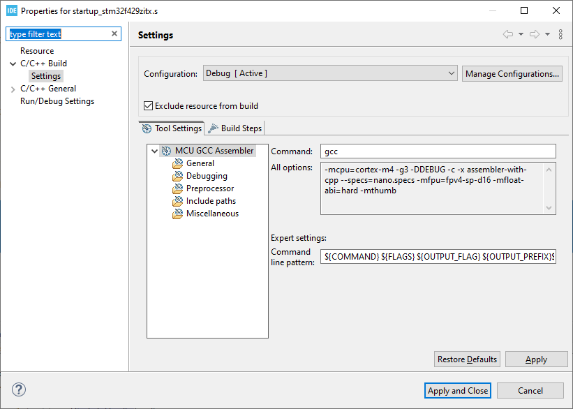

# STM32 startup code

- STM32
- STM32CubeIDE
- NUCLEO-F429ZI
- C
- Assembly
- ARM
- Cortex
- Embedded


## Links

- [Klein Embedded: STM32 without CubeIDE](https://kleinembedded.com/stm32-without-cubeide-part-1-the-bare-necessities/)
- [ARM® Assembly rererence](https://developer.arm.com/documentation/dui0802/latest/)

Working environment:
- Windows 11.
- STM32CubeIDE version 1.16.0.
- Firmware package 1.28.0.

After reading an excellent  [STM32 without CubeIDE](https://kleinembedded.com/stm32-without-cubeide-part-1-the-bare-necessities/) series of articles, I decided to make my own exercise, the result of this exercise is shown in this article. In the project, created by STM32CubeIDE, there is startup file, written in Assembly language. I want to reqrite this file in the C language, and by the way to learn some interesting things about STM32 startup process.

I am using [NUCLEO-F429ZI](https://www.st.com/en/evaluation-tools/nucleo-f429zi.html) evaluation board. It is possible to make the same exercise with any STM32 board. Several files, generated by STM32CubeMX, have board-specific names, I will call them by using general names:
- STM32F429ZITX_FLASH.ld will be called **Linker script**.
- startup_stm32f429zitx.s will be called **Assembly startup file**.

## Creating a new STM32 project

- Run STM32CubeIDE.
- File - New - STM32 project.
- Board selector - NUCLEO-F429ZI - Next. On this tsage, select your actual board.
- Select project name and location (better to use non-default location, i.e. not under the workspace directory). Language C. Binary type - executable. Project type - STM32Cube. Next.
- Accept default options, including the latest firmware package. In my case this is STM32Cube FW_F4 V.1.28.0. Finish.
- *Initialize all peripherals with their default mode?* No.

## Modifying the source code

Open file `Core/Scr/main.c` and this code to the endless loop in the `main` function, `USER CODE BEGIN 3` section:

```
    /* USER CODE BEGIN 3 */
    HAL_GPIO_TogglePin(LD1_GPIO_Port, LD1_Pin);
    HAL_Delay(500);	  
```

Build and run the project: LED1 is blinking. Later in the article, I will call this project state as **Default state**. At any time, when necessary, it is possiblt to return to this ***Default state** by activating the Assembly startup file.

## Replacing Assembly startup file with C file

Right-click the Assembly startup file in `Core/Src/Startup` directory, select C/C++ Build - Settings, check Exclude resource from build:



Try to build the project, result is: `cannot find entry symbol Reset_Handler`. `Reset_Handler` is defined in the linker script, as the program entry point: 

```
ENTRY(Reset_Handler)
```

It was defined in Assembly file, now we need to provide another implementation. Add new file `startup.c` to `Core/Src` and fill it with the following code:

```
#include <stdint.h>

void Reset_Handler();
void Default_Handler();
int main(void);

uint32_t g_data1 = 0xA1020304;	// Initialized data
uint32_t g_data2;               // Uninitialized data

void Reset_Handler()
{
    for(;;) {}
}
```
Build and run the program. With debugger we can see, that it starts to execute an endless loop. 

## Setting the stack pointer

Set breakpoint in the line `for(;;) {}` and start debugger. What is the value of `sp` register? In my case, it shows `0x4c05b50c`, this looks like a junk.

Return to default state by including Assembly startup file to the build, and excluding `startup.c` file. Set breakpont in the Assembly startup file, on the first line of `Reset_Handler` function. Execute this line and check `sp` register: `0x20030000`. 

Back to `starup.c`: include it to build and exclude the Assembly file from build. How can we fix the stack pointer?

Cortex executable must start from a vector table, which contains initial stack pointer it position 0, and interrupt handlers, starting from position 1. 

From the linker script:

```
RAM    (xrw)    : ORIGIN = 0x20000000,   LENGTH = 192K
FLASH    (rx)    : ORIGIN = 0x8000000,   LENGTH = 2048K
```

We can define:
```
#define SRAM_START (0x20000000U)
#define SRAM_SIZE (192U * 1024U)                // 0x30000
#define SRAM_END (SRAM_START + SRAM_SIZE)
#define STACK_POINTER_INIT_ADDRESS (SRAM_END)
```

`STACK_POINTER_INIT_ADDRESS` gives `0x20030000`.

We need also `Default_Handler` function, which is called for anu unimplemented interrupt:

```
void Default_Handler()
{
    for(;;){}
}
```

Define a minimal set of interrupt handlers, copy their names from Assembly startup file:

```
// Cortex-M system exceptions
void Nmi_Handler(void) __attribute__((weak, alias("Default_Handler")));
void Hard_Fault_Handler(void) __attribute__((weak, alias("Default_Handler")));
void Bus_Fault_Handler(void) __attribute__((weak, alias("Default_Handler")));
void Usage_Fault_Handler(void) __attribute__((weak, alias("Default_Handler")));
```

Some of them may be implemented somewhere in the project. If not, the handler is mapped to `default_handler`. Finally, define the vector table:

```
uint32_t g_pfnVectors[] __attribute__((section(".isr_vector"))) =
{
  STACK_POINTER_INIT_ADDRESS,
  
  // Cortex-M system exceptions
  (uint32_t)&Reset_Handler,
  (uint32_t)&Nmi_Handler,
  (uint32_t)&Hard_Fault_Handler,
  (uint32_t)&Bus_Fault_Handler,
  (uint32_t)&Usage_Fault_Handler
};
```

Start debuggin with breakpoint at endless loop in `Reset_Handler`. The value of `sp` register is:
```
0x2002fffc = 0x20030000 - 4
```

Seems to be OK. Now that stack pointer is fixed, let's see the next problem. I want to see the values of `g_data1` and `g_data2` variables. Sometimes debugger is not happy to show a global varables, this temporary code helps to see this information:

```
    asm ("ldr r0, = g_data1");  // r0 = &g_data1    0x20000000
    asm ("ldr r1, [r0]");       // r1 = *r0         0xbe00                 junk, expected 0xA1020304
    asm ("ldr r2, = g_data2");  // r2 = &data2      0x20000020
    asm ("ldr r3, [r2]");       // r3 = *r2         0x60015155             junk, expected 0
```

## Global variables


