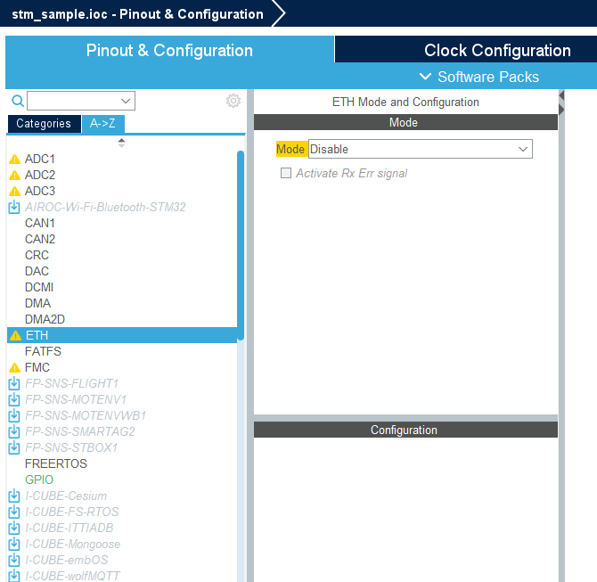

# STM32 TCP communications

- STM32
- STM32CubeIDE
- NUCLEO-F429ZI
- TCP
- TCP server
- IPv4
- C
- Embedded

This document describes building and running the program for [NUCLEO-F429ZI](https://www.st.com/en/evaluation-tools/nucleo-f429zi.html) evaluation board. Any other STM32 F4 board with an Ethernet connector can be used. Just follow the same steps, as described in this article, making corrections for specific board type, when necessary.

The code in this repository is based on `LwIP_HTTP_Server_Netconn_RTOS` code example for NUCLEO-F429ZI evaluation board: 

**Copyright (c) 2017 STMicroelectronics** 

and other STM32 examples.

Working environment:
- Windows 11.
- STM32CubeIDE version 1.16.0.
- Firmware package 1.28.0.

## Software installation

If not installed yet, download and install [STM32CubeIDE](https://www.st.com/en/development-tools/stm32cubeide.html). Downloading is free, requires e-mail registration. Keep e-mail and password for future use.

When STM32CubeIDE is executed first time, login to your STM32 account. Otherwise, you will be asked for login details later.

## STM32 projects in the samples repository

Having NUCLEO-F429ZI evaluation board, it is poissible to use [stm_sample](stm_sample/) project directly:
- Start STN\M32CubeIDE. File - Import - General - Existing project into workspace. Select `stm_sample` directory.
- Open Device Configuration tool: double-click `stm_sample.ioc`.
- Execute command Project - Generate code. Only minimal set of files is kept in the repository. Missing files are created during code generation.
- Build and run the project.
- Test it it using [TCP client](../../Networking/TCP/TcpHexClient/).

For any other STM32 board it is necessary to create a new project, make device configuration and add the code. There is no binary compatibility between different boards.

[diff](./diff/) directory contains the same project on different development stages:

- [diff/1.new_project](diff/1.new_project/) - just created by STM32CubeIDE Wizard.
- [diff/2.cubemx](diff/2.cubemx/) - device configuration finished.

It is possible to compare these directories and view the changes:
- Difference between [diff/1.new_project](diff/1.new_project/) and [diff/2.cubemx](diff/2.cubemx)/ is device configuration.
- Difference between  [diff/2.cubemx](diff/2.cubemx/) and [stm_sample](stm_sample/) is application code.

Viewing the difference can help you to create your own project. Device configuration and coding may be different for another board, use destination board documentation and code examples, if something goes wrong.


## Creating a new STM32 project

- Run STM32CubeIDE.
- File - New - STM32 project.
- Board selector - NUCLEO-F429ZI - Next. On this tsage, select your actual board.
- Select project name and location (better to use non-default location, i.e. not under the workspace directory). Language C. Binary type - executable. Project type - STM32Cube. Next.
- Accept default options, including the latest firmware package. In my case this is STM32Cube FW_F4 V.1.28.0. Finish.
- *Initialize all peripherals with their default mode?* No.

Project Explorer should look like this:


If you don't see full source files tree - open Device Configuration tool (double-click `stm_sample.ioc` in the Project Explorer), and execute Project - Generate code.

At this stage it is possible to build the project and run it on the board. 

---
Tip for new Eclipse users.

If you see this message:
*The selection cannot be launced, and there are no recent launches*, 
Open Run configurations dialog and create new STM32 configuration:


---

Execute this "do-nothing" program:

```
STMicroelectronics ST-LINK GDB server. Version 7.8.0
Copyright (c) 2024, STMicroelectronics. All rights reserved.

Starting server with the following options:
        Persistent Mode            : Disabled
        Logging Level              : 1
        Listen Port Number         : 61234
        Status Refresh Delay       : 15s
        Verbose Mode               : Disabled
        SWD Debug                  : Enabled
        InitWhile                  : Enabled

Waiting for debugger connection...
Debugger connected
Waiting for debugger connection...
Debugger connected
Waiting for debugger connection...
      -------------------------------------------------------------------
                       STM32CubeProgrammer v2.17.0                  
      -------------------------------------------------------------------

Log output file:   C:\Users\Alex\AppData\Local\Temp\STM32CubeProgrammer_a13456.log
ST-LINK SN  : 066DFF484957847167063817
ST-LINK FW  : V2J43M28
Board       : NUCLEO-F429ZI
Voltage     : 3.25V
SWD freq    : 4000 KHz
Connect mode: Under Reset
Reset mode  : Hardware reset
Device ID   : 0x419
Revision ID : Rev 3
Device name : STM32F42xxx/F43xxx
Flash size  : 2 MBytes
Device type : MCU
Device CPU  : Cortex-M4
BL Version  : 0x91

Memory Programming ...
Opening and parsing file: ST-LINK_GDB_server_a13456.srec
  File          : ST-LINK_GDB_server_a13456.srec
  Size          : 6.20 KB 
  Address       : 0x08000000 

Erasing memory corresponding to segment 0:
Erasing internal memory sector 0
Download in Progress:

File download complete
Time elapsed during download operation: 00:00:00.368

Verifying ...

Download verified successfully 

Shutting down...
Exit.
```

This initial state is kept in [diff/1.new_project](diff/1.new_project/) directory. 


## Device Configuration



The left configuration pane contains the list of devices and software packages. Select required element and then configure it in the right pane.

---

Tip. 
At any time during device configuration, STM32CubeIDE may complain about clock issues. In this case select Clock Configuration, Automatic clock issues solver.

---

### UART for tracing

Select USART3, set the following parameters: Mode Asynchronous, Flow control Disabled, Baud rate 115200, Word length 8, Parity None, Stop bits 1.

---

USART3 in NUCLEO-F429ZI is connected to Serial-over-USB port. On another board, UART port may be different - see specific board documentation. Connect the board to PC with USB cable. Required STM32 drivers should be already installed, this is done by STM32CubeIDE installation. Open PC Device manager:


We can view COM4 (name may be different), using any serial port terminal. For example, Serial Monitor extension in Visual Studio Code. Once installed, select Terminal - New Terminal - Serial Monitor. Set required serial port parameters, as in STM32 project, and click Start Monitoring:


Later in this document, this monitor window is mentioned as **Serial Log**. Our program will use `printf` to print information to the Serial Log. For now, this window is empty.

---

### Ethernet

ETH. Mode: RMII.

### SYS

Timebase source: TIM1

### FreeRTOS

CMSIS_V2. Config parameters, USE_PREEMPTION: Enabled.

Advanced settings. USE_NEWLIB_REENTRANT Enabled.

Tasks and queues: defaultTask and serverTask. 

 


### LWIP

Enabled. 
- General settings. DHCP: Disabled. IP address: `192.168.0.32`, Subnet mask `255.255.255.0`.
- Platform settings, Driver_PHY: LAN8742. For another board, this may be different.

### NVIC
   
Ethernet global interrupt: Enabled, Priority 6.

## Testing device configuration

Device configuration finished. Save `.ioc` file, generate code. Build and run the project.

Connect the board and PC with Ethernet cable. Set PC static IP address `192.168.0.1`, subnet mask 255.255.255.0. Test connection:

```
C:\WINDOWS\system32>ping -t 192.168.0.32

Pinging 192.168.0.32 with 32 bytes of data:
Reply from 192.168.0.32: bytes=32 time<1ms TTL=255
...
```

Leave it for at least several minutes - ping must work without errors, 0% loss. If ping doesn't work, there is no point to continue. The problem must be solved now.

Maybe this is old STM bug, which is fixed by changing an optimization level from `-O0` to `-Og`:

 

Still not working? Compare [diff/2.cubemx](diff/2.cubemx/) directory (device configuration finished) with [diff/1.new_project](diff/1.new_project/) directory. You can see all the changes in `stm_sample.ioc` file. Review them, maybe device configuration is incorrect.

Try to debug the project. The most interesting place for debugging is `MX_LWIP_Init` function. In the end of this function, check this condition: 

```
if ( gnetif.flags & NETIF_FLAG_UP )
{
  // LWIP initialization succeeded
}
else
{
  // LWIP initialization failed
}
```

Once ping is working, we can continue.

This Device Configuration finished state is kept in [diff/2.cubemx](diff/2.cubemx/) directory.

## Coding

Time for programming. Compare [diff/2.cubemx](diff/2.cubemx/) and [stm_sample](stm_sample/) directories. The difference is the code that we need to add now to our project.

Add file [tcpserver.cpp](stm_sample/Core/Src/tcpserver.c) to the project. Other files should be updated. For every file, managed by CubeMX, user code must be inside special code sections:

```
/* USER CODE BEGIN section-name */

// Code inside the section is preserved during CubeMX code generation.

/* USER CODE END section-name */
```

Full list of files and code sections, that should be updated:

```
tcpserver.c - add this file

main.h
  USER CODE BEGIN Private defines

main.cpp
  USER CODE BEGIN Includes
  USER CODE BEGIN PV
  USER CODE BEGIN PFP
  USER CODE BEGIN 0
  USER CODE BEGIN 2
  USER CODE BEGIN 5
  USER CODE BEGIN StartServerTask     !

lwip.c
  USER CODE BEGIN 3
```

## Testing

`stm_sample` project is configured, user code is added and compiled. NUCLEO-F429ZI or another STM32 board is connected to the PC using USB. STMicroelectroncs STLink virtual COM port is available on the PC. Serial monitor can be used to view the program log messages.

`stm_sample` IP address is `192.168.0.32 / 24`. TCP port is 50000. STM board is connected to PC using Ethernet cable. PC IP address is `192.168.0.1 / 24`.

Start serial monitor (see **UART for tracing** section in this document), connect to STLink COM port. Build and run `stm_sample` program.

Serial log:

```
stm_sample
built at Aug 27 2024 13:08:47
Release configuration
network interface is up. IP address 192.168.0.32
tcpserver_thread started
tcpserver_thread listening port 50000
```

Test IP connection:

```
C:\WINDOWS\system32>ping 192.168.0.32

Pinging 192.168.0.32 with 32 bytes of data:
Reply from 192.168.0.32: bytes=32 time<1ms TTL=255
Reply from 192.168.0.32: bytes=32 time<1ms TTL=255
Reply from 192.168.0.32: bytes=32 time<1ms TTL=255
Reply from 192.168.0.32: bytes=32 time<1ms TTL=255

Ping statistics for 192.168.0.32:
    Packets: Sent = 4, Received = 4, Lost = 0 (0% loss),
Approximate round trip times in milli-seconds:
    Minimum = 0ms, Maximum = 0ms, Average = 0ms
```

To talk with `stm_sample` TCP server, we can use [TCP client](../../Networking/TCP/TcpHexClient/):

```
C:\tmp\samples\Networking\TCP\TcpHexClient>python hex_client.py
15:47:53.998: <module>: HexClient started
15:47:54.010: _load: host "192.168.0.32" port 50000 ipv 0 data 00 01 FF
15:47:54.011: __init__: MessageQueue created
15:47:54.011: run: thread function started
```

Set IP address `192.168.0.32`, port 50000, IPv4, click Connect. Type any hexadecimal string and click Send, the same string should be received, since `stm_sample` is echo server:


Don't try to run several TCP clients, our server can handle only one client at the same time.

Finally, less significant bit of every received byte defines the state of LED1: 0 - LED1 is off, 1 - LED1 is on. So, if the last received byte is even, LED1 is off, odd - LED1 is on.


